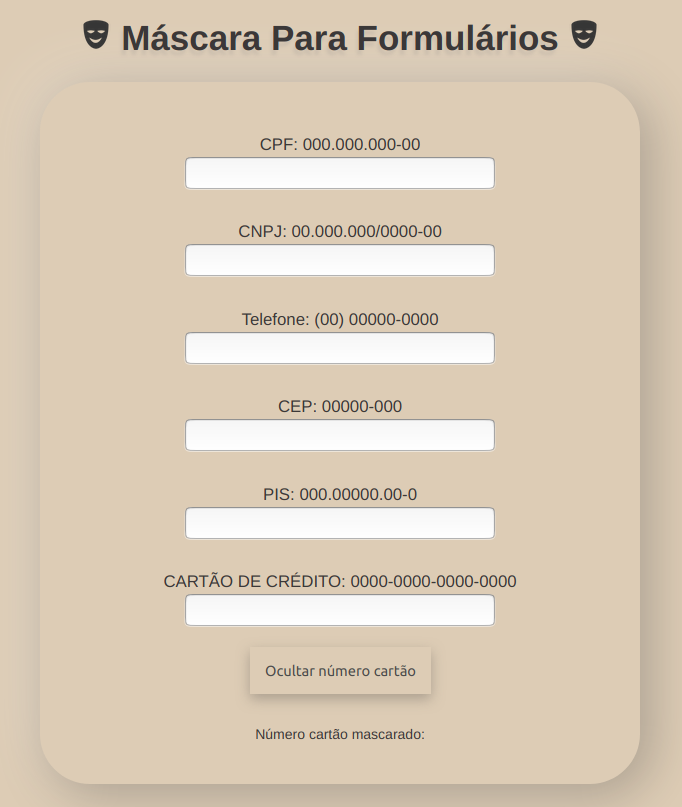

<div align="center">


<h1>
Máscara para Formulários
</h1>

<hr>

 

</div>

<div align="center">



</div>

## Sobre:

Simples projeto para mascarar `inputs` de formulários usando somente JavaScript puro e Regex. Este projeto foi feito com objetivo de ser uma consulta para futuros projetos que forem requeres máscaras de dados de usuário.

Os seguintes campos podem ser mascarados:

- CPF
- CNPJ
- Telefone ou celular
- PIS
- Cartão de crédito

Para a opção de cartão de crétido, temos o botão `Ocultar números cartão` para ocultar o número do cartão, substituindo por `*` e deixando apenas os últimos 4 dígitos.

Abaixo o código essencial da aplicação para ser implementada em outros projetos quando necessário.

## Código HTML:

```html
<section class="main-form">
  <div class="main-form__mask--input">
    <label>CPF: 000.000.000-00</label>
    <input type="text" data-js="cpf" autofocus />
  </div>
  <div class="main-form__mask--input">
    <label>CNPJ: 00.000.000/0000-00</label>
    <input type="text" data-js="cnpj" />
  </div>
  <div class="main-form__mask--input">
    <label>Telefone: (00) 00000-0000</label>
    <input type="text" data-js="phone" />
  </div>
  <div class="main-form__mask--input">
    <label>CEP: 00000-000</label>
    <input type="text" data-js="cep" />
  </div>
  <div class="main-form__mask--input">
    <label>PIS: 000.00000.00-0</label>
    <input type="text" data-js="pis" />
  </div>
  <div class="main-form__mask--input">
    <label>CARTAO DE CREDITO: 0000-0000-0000-0000</label>
    <input type="text" data-js="cartao" />
    <button id="mascara-cartao">Ocultar número cartão</button>
  </div>
  <div>
    <p>Número cartão mascarado:</p>
    <p id="numero-salvo"></p>
  </div>
</section>
```

## Código JavaScript:

```javascript
const mask = {
  cpf(value) {
    return value
      .replace(/\D/g, "") // aceita somente caracteres numero.
      .replace(/(\d{3})(\d)/, "$1.$2") // () => permite criar grupos de captura.
      .replace(/(\d{3})(\d)/, "$1.$2") // $1, $2, $3 ... permite substituir a captura pela propria captura acrescida de algo
      .replace(/(\d{3})(\d{2})/, "$1-$2") // substitui '78910' por '789-10'.
      .replace(/(-\d{2})\d+?$/, "$1");
  },

  cnpj(value) {
    return value
      .replace(/\D/g, "")
      .replace(/(\d{2})(\d)/, "$1.$2")
      .replace(/(\d{3})(\d)/, "$1.$2")
      .replace(/(\d{3})(\d)/, "$1/$2")
      .replace(/(\d{4})(\d{1,2})/, "$1-$2")
      .replace(/(-\d{2})\d+?$/, "$1");
  },

  phone(value) {
    return value
      .replace(/\D/g, "")
      .replace(/(\d{2})(\d)/, "($1) - $2")
      .replace(/(\d{4})(\d)/, "$1-$2")
      .replace(/(\d{4})-(\d)(\d{4})/, "$1$2-$3")
      .replace(/(\d{4})\d+?$/, "$1");
  },

  cep(value) {
    return value
      .replace(/\D/g, "")
      .replace(/(\d{5})(\d)/, "$1-$2")
      .replace(/(-\d{3})\d+?$/, "$1");
  },

  pis(value) {
    return value
      .replace(/\D/g, "")
      .replace(/(\d{3})(\d)/, "$1.$2")
      .replace(/(\d{5})(\d)/, "$1.$2")
      .replace(/(\d{5})\.(\d{2})(\d)/, "$1$2-$3")
      .replace(/(-\d)\d+?$/, "$1");
  },

  cartao(value) {
    return value
      .replace(/\D/g, "")
      .replace(/(\d{4})(\d)/, "$1-$2")
      .replace(/(\d{4})(\d)/, "$1-$2")
      .replace(/(\d{4})(\d)/, "$1-$2")
      .replace(/(-\d{4})\d+?$/, "$1");
  },
};

document.querySelectorAll("input").forEach((input) => {
  const field = input.dataset.js;

  input.addEventListener("input", (event) => {
    event.target.value = mask[field](event.target.value);
  });
});

// ocultar numeros cartao deixando somente os 4 ultimos
const mascaraNumero = (numero) => {
  return [...new Array(3).fill("****"), numero.slice(-4)].join("-");
};

document.getElementById("mascara-cartao").addEventListener("click", (event) => {
  const numeroCartao = document.querySelector('[data-js="cartao"]').value;

  if (numeroCartao.split("-").join("").length === 16) {
    document.getElementById("numero-salvo").innerHTML =
      mascaraNumero(numeroCartao);
  }
});
```

Se desejar testar localmente, use o [Git](https://git-scm.com/) para clonar este repositório:

```bash
$ git clone https://github.com/IglanCardeal/mascara-formularios
```

Entre na pasta `mascara-formularios` e abra o arquivo `index.html`.

<p id="autor"></p>


<b>João Cardoso</b>

Desenvolvido e João Cardoso :hammer: </br>
Desenvolvedor Front end 💻 <br>
Entre em contato! 👋🏽

joaolucascardosocorreia@gmail.com
